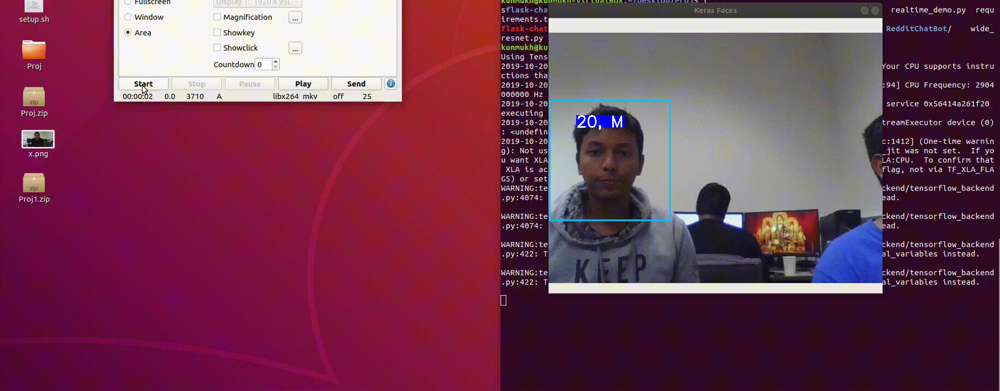

# OpenChat
Chat application built on top of google translate api.

Input - Username, Message and base language.

# Chatroom application 

user sees messages in the base language.

Youtube Link - https://www.youtube.com/watch?v=qIXZfg3VyG8&feature=youtu.be

We extend our full credits to the following :

https://github.com/Tony607/Keras_age_gender

https://github.com/gunthercox/ChatterBot

